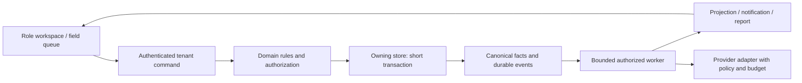

# Domain and dependency map

Updated 2026-09-08 from source. This replaces the older size/defect snapshot with
current ownership and known extraction boundaries. See [ADR 0002](../adr/0002-domain-boundaries.md).

| Domain | Current owners / entry points | Public authority and boundary |
| --- | --- | --- |
| Identity and tenancy | `server/auth*`, `server/routes.ts`, `server/tenantGuard.ts`, `shared/capabilities.ts`, `client/src/lib/auth.tsx` | Verified actor, tenant and server capability. Immutable platform authority is separate from mutable roles. Legacy null fallbacks require explicit audit. |
| Leads and evidence | `server/storage.ts`, `scanIntelStore.ts`, `freshFiberProjector.ts`, `leadRanking.ts` | Canonical lead/evidence state; ranking is advisory. Consumers must preserve authoritative eligibility and tenant ownership. |
| Territory and assignment | `territoryAssignments.ts`, assignment routes, shared selection geometry contracts | Server visibility, preview/apply parity, committed assignments and CAS undo. Shared territory membership is intentional; direct-owner precedence remains an open product decision. |
| Field activity | `storage.createKnock`, `LeadKnockSheet`, `useKnockLogger`, `knockQueue.ts` | Durable staging before GPS; server idempotency/supersession; pending presentation cannot claim confirmed money. |
| Calling and callbacks | `server/calling/routes.ts`, `service.ts`, `store.ts`, `scriptEngine.ts` | Eligibility, consent/DNC/hour rules, session outcomes and callback lifecycle. Optional AI cannot weaken compliance or authorize contact. |
| Discovery and scanning | `addressDiscovery/*`, `scanEngine.ts`, `scanIntelStore.ts`, `providerRequestQueue.ts`, provider adapters | Authorized finite jobs, normalization, evidence, spend/concurrency, retry/lease state and publication. Transport does not decide business eligibility. |
| Commissions and incentives | `commissionService.ts`, `reserveService.ts`, `incentiveSubscriber.ts`, ledger/stores | Server-calculated legal transitions, immutable financial evidence and idempotent awards. Legacy and weekly paths need explicit convergence design before consolidation. |
| Onboarding and workforce | onboarding services/stores, academy, mileage/referral/earnings modules | Identity/privacy, training and workforce state. Existing Applications belongs to current capability holders; no recruiter role is silently added. |
| Notification and events | `domainEventStore.ts`, `eventQueueOps.ts`, `stateMonitorScheduler.ts` | Local atomic facts, dedupe, ordered financial delivery, tenant-owned recovery and bounded notification retention. Remote delivery is at-least-once. |
| Reporting and guidance | `repMetricsAggregator.ts`, `opsQueues.ts`, `commissionReconciliation.ts`, shared coaching/priority rules | Derived views and explainable suggestions; never overwrite canonical eligibility, ownership or pay facts. |
| Platform | `server/index.ts`, `globalMaintenance.ts`, `scanConsumeRole.ts`, deployment workflows | Worker ownership, health, release provenance, finite maintenance and recovery. Current shared SQLite/process-local state limits multi-host scaling. |

## Existing product surfaces to extend

`App.tsx` has lazy routes and retained stages. Existing tokens, Radix components,
page scaffold, Rep Today, management Dashboard/Ops, Applications and Governance
are the UI starting point. Map viewport feeds, density tiers and the virtualized
`LeadsInViewPanel` already exist. Extract a characterized controller or typed API
slice, not the entire 10,000+ line map at once.

Assignment preview/confirm/partial counts/audit/undo already ship. Its replay and
undo receipts remain process-local, which is the durability gap to solve before
cross-worker scaling. Offline knock replay already ships; a last-view snapshot
is not a complete territory pack or offline basemap.

Deterministic rankings/coaching already ship, plus optional time-bounded calling
script enhancement in `server/calling/scriptEngine.ts`. A shared AI privacy,
cost and evaluation contract precedes broader assistance.

## Extraction rule

Choose one observable workflow; record current permissions, result/ordering,
side effects, idempotency and recovery. Extract its command/store interface while
preserving those contracts. New domains require distinct ownership or invariants;
new deployables additionally require [measured extraction criteria](service-boundaries.md).
Historical audits under `docs/` remain useful evidence, but their old file sizes,
missing-feature claims and unresolved-defect lists must be revalidated.
